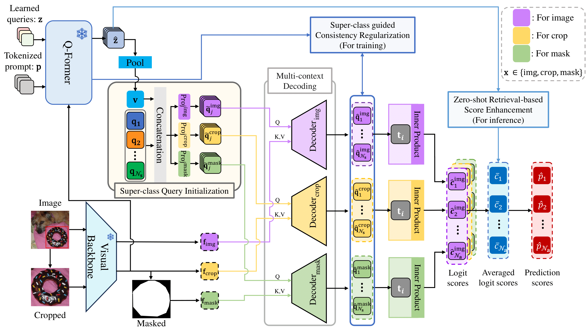

<p align="center">
  <h1 align="middle"> Super-class guided Transformer for Zero-Shot Attribute Classification </h1>
  
  <p align="middle">Sehyung Kim*, Chanhyeong Yang*, Jihwan Park, Taehoon song, Hyunwoo J. Kim†.
  </p>
  <p align="middle">AAAI 2025</p>
</p>

----



This is the official implementation of AAAI 2025 paper "Super-class guided Transformer for Zero-Shot Attribute Classification"

----

## Environment Setting
```bash
git clone https://github.com/mlvlab/SugaFormer.git
cd SugaFormer
conda create -n sugaformer python==3.9
conda activate sugaformer
pip install torch==1.13.1+cu117 torchvision==0.14.1+cu117 torchaudio==0.13.1 --extra-index-url https://download.pytorch.org/whl/cu117
pip install -r requirements.txt
```

----

## Dataset Preparation

To run experiments for VAW, you need both the images from the Visual Genome dataset and the annotation files. Follow the steps below:

1. Download the Visual Genome images from the [link](https://homes.cs.washington.edu/~ranjay/visualgenome/index.html).
2. Download the annotation files for VAW experiments from the [link](https://drive.google.com/drive/folders/1qW3HkMcdLHnsCDXn00TyFD4rAlErZRRW?usp=drive_link).


### Organize the Data
After downloading the Visual Genome images and annotation files, organize them into the following directory structure:

```bash

data/
└── vaw/
     ├── images/
     │   ├── VG_100K/
     │   └── VG_100K_2/
     │
     └── annotations/
         ├── train.json
         ├── test.json
         ├── ...

```

## Training

### VAW Fully-Supervised
Train the model in the fully-supervised setting:
```bash
./configs/vaw/train_fs.sh
```

### VAW Zero-Shot (base2novel)
Train the model for zero-shot attribute classification in zero-shot setting:
```bash
./configs/vaw/train_zs.sh
```
## Evaluation

### VAW Fully-Supervised
Evaluate the model in the fully-supervised setting:
```bash
./configs/vaw/eval_fs.sh
```
### VAW Zero-Shot (base2novel)
Evaluate the model in the zero-shot setting:
```bash
./configs/vaw/eval_zs.sh
```

## Acknowledgements
This repository is built upon the following works:

* [DETR (Facebook Research)](https://github.com/facebookresearch/detr): The codebase we built upon and the foundation for our base model.

* [LAVIS (Salesforce)](https://github.com/salesforce/LAVIS): Pre-trained Vision-Language Models (BLIP2) that we utilized for feature extraction and knowledge transfer.

## Contact
If you have any questions, please create an issue on this repository or contact at shkim129@korea.ac.kr.
